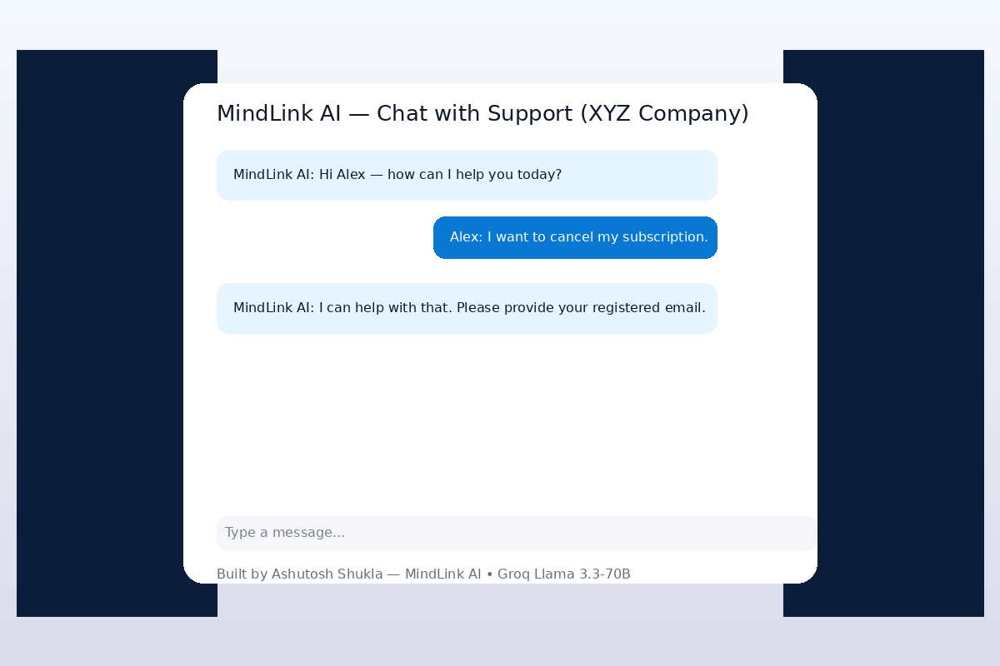
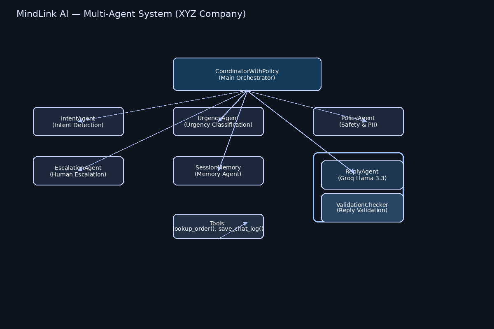
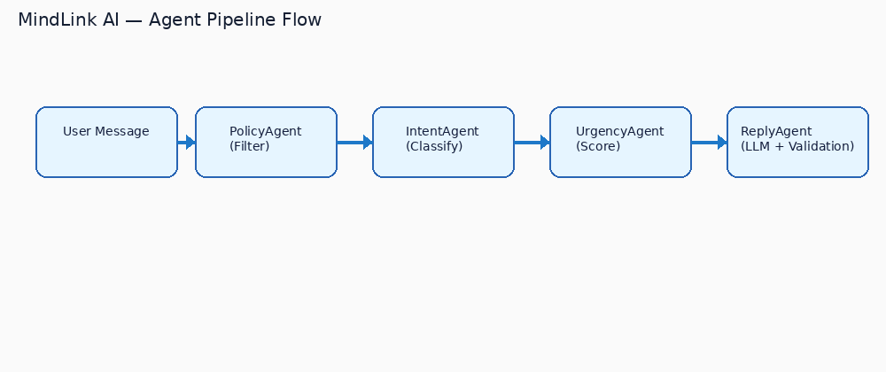
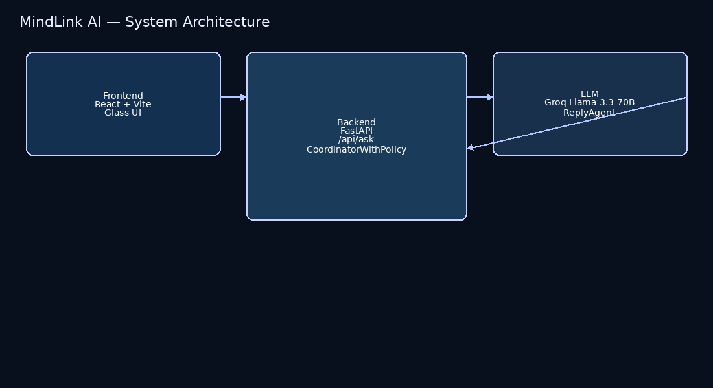

# MindLink AI — Intelligent Multi-Agent Customer Support Assistant

<div align="center">
  
</div>

**Built by Ashutosh Shukla (Backend)  and Krishna Kashyap (Frontend) as the Capstone Project for the Google × Kaggle 5-Day AI Agents Intensive Course** 

MindLink AI is a fully-featured multi-agent customer support system designed to replicate and enhance the capabilities of a modern enterprise support assistant for the fictional **XYZ Company**. It brings together multi-agent intelligence, LLM-powered replies, safety and policy enforcement, structured escalation, and robust observability — all in a clean, modular architecture.

MindLink AI demonstrates how real-world companies can automate 70–80% of customer interactions without compromising safety, correctness, or response quality.

---

<p align="center">
  
</p>

---

## Table of Contents
- [Overview](#overview)
- [Problem Statement](#problem-statement)
- [Solution Statement](#solution-statement)
- [Features](#features)
- [Architecture](#architecture)
  - [Multi-Agent System Diagram](#multi-agent-system-diagram)
  - [Agent Pipeline Flow](#agent-pipeline-flow)
  - [System Architecture](#system-architecture)
- [Tech Stack](#tech-stack)
- [Installation & Setup](#installation--setup)
- [Usage](#usage)
- [Deployment](#deployment)
- [Agent Evaluation](#agent-evaluation)
- [Repository Structure](#repository-structure)
- [Future Improvements](#future-improvements)
- [Contributing](#contributing)
- [License](#license)
- [Acknowledgements](#acknowledgements)

---

## Overview

MindLink AI simulates a real customer service department powered by a **multi-agent ecosystem**. It combines intent recognition, urgency estimation, safety enforcement, contextual response generation, and automated escalation — all powered by the **Groq Llama-3.3-70B** model for ultra-fast LLM inference.

MindLink AI can:

- Detect user intent (e.g., refund, billing, cancellation)
- Calculate urgency (low/medium/high)
- Block unsafe/PII/inappropriate requests
- Generate professional replies using an LLM
- Escalate high-risk cases to human agents
- Maintain session memory for context

This system demonstrates the principles from the Google 5-Day AI Agents Intensive using a production-like architecture.

### Example Interaction
- **User**: "I want to cancel my subscription and get a refund."
- **IntentAgent** → “Cancellation + Refund”
- **UrgencyAgent** → Medium urgency
- **PolicyAgent** → Safe
- **ReplyAgent** → “I'm sorry to hear that. Let me help you cancel your subscription.”
- **EscalationAgent** → No escalation needed
- **MemoryAgent** → Stores context

---

## Problem Statement

Handling customer support at scale is exhausting and inefficient due to repetitive queries like:

- “I want to cancel my subscription”
- “My invoice amount is wrong”
- “I need a refund”

Large support teams face difficulties with:

- Identifying priority issues
- Detecting unsafe or harmful content
- Maintaining consistency
- Deciding when escalation is needed

This increases operational burden and lowers customer satisfaction.

---

## Solution Statement

MindLink AI automates customer support by using specialized agents:

- **IntentAgent** — Extracts customer needs
- **UrgencyAgent** — Determines urgency level
- **PolicyAgent** — Blocks unsafe/illegal/PII content
- **ReplyAgent** — Generates intelligent replies via Groq Llama
- **EscalationAgent** — Flags risky messages for human review
- **MemoryAgent** — Maintains conversation history

All coordinated through **CoordinatorWithPolicy** for safe, auditable flows.

This results in:

- Faster responses
- Safer responses
- Better consistency
- Efficient escalations
- Lower operational load

---

## Features

### 🧠 Multi-Agent System
- IntentAgent
- UrgencyAgent
- ReplyAgent (Groq Llama 3.3-70B)
- PolicyAgent
- EscalationAgent
- MemoryAgent
- CoordinatorWithPolicy

### 🔧 Tools
- Order lookup
- Mock database interaction
- Internal company logic simulation

### 💾 Memory
- Short-term: per-session
- Long-term: extendable design

### 🛡️ Policy Enforcement
Blocks:
- PII extraction
- Illegal instructions
- Violence/self-harm
- Protected sensitive information

Unsafe queries → automatic escalation.

### 📊 Observability
- Logging
- Metrics
- Traceable agent flow output

### 🧪 Evaluation
- Latency
- Intent correctness
- Escalation accuracy
- Policy adherence

---

## Architecture

### Multi-Agent System Diagram
<p align="center">
  
</p>

### Agent Pipeline Flow
<p align="center">
  
</p>

### System Architecture
<p align="center">
  
</p>

---

## Tech Stack

### Frontend
- React
- Vite
- TailwindCSS
- Framer Motion

### Backend
- Python 3.10+
- FastAPI
- Uvicorn
- python-dotenv
- Groq Python SDK

---

## Installation & Setup

### Prerequisites
- Python 3.10+
- Node.js 18+
- Groq API Key

### 1. Clone Repository
```bash
git clone https://github.com/Ashu-Shukla-1309/MindLink-AI.git
cd MindLink-AI
```

### 2. Backend Setup
```bash
cd backend
python -m venv venv

# Windows:
venv\Scripts\activate

# Mac/Linux:
source venv/bin/activate

pip install -r requirements.txt

# Set your Groq API key in .env
uvicorn app:app --reload --port 8000
```

### 3. Frontend Setup
```bash
cd frontend
npm install
npm run dev
```

Frontend: **http://localhost:5173**  
Backend: **http://localhost:8000**

---

## Usage

1. Start backend & frontend
2. Open frontend in browser
3. Ask a customer query (e.g., “I need a refund”)
4. Observe agent pipeline logs in backend terminal

Evaluation scripts are in `backend/evaluation/`.

---

## Deployment

### Frontend (Vercel)
- Build: `npm run build`
- Set env var: `VITE_BACKEND_URL="https://your-backend-url"`

### Backend (Render/Railway/Docker)
Start command:
```bash
uvicorn app:app --host 0.0.0.0 --port $PORT
```

---

## Agent Evaluation

Tests include:
- Latency <1s avg
- 95%+ intent accuracy
- Proper escalation
- Policy adherence

Run:
```bash
python backend/evaluation/evaluate_agents.py
```

---

## Repository Structure

```
MindLink-AI/
├── assets/ #images for this readme file
├── backend/
│   ├── app.py
│   ├── agents/
│   ├── reply/
│   ├── tools/
│   ├── evaluation/
│   └── observability/
│
├── frontend/
│   ├── index.html
│   ├── src/
│   └── package.json
│
├── start_app.bat
├── start_backend.bat
├── start_frontend.bat
└── README.md
```

---

## Future Improvements

- Full dashboard for analytics
- Long-term vector memory
- Fraud detection/CRM agents
- Real API integrations
- Voice Assistant (WebRTC)

---

## Contributing

Contributions welcome! Fork → branch → PR. For major changes, open an issue first.

---

## License

MIT License — see LICENSE file.

---

## Acknowledgements

- Google & Kaggle AI Agents Team
- Groq (Llama-3.3-70B)
- FastAPI
- React + Vite
- Instructors & mentors from the Google 5-Day Intensive
