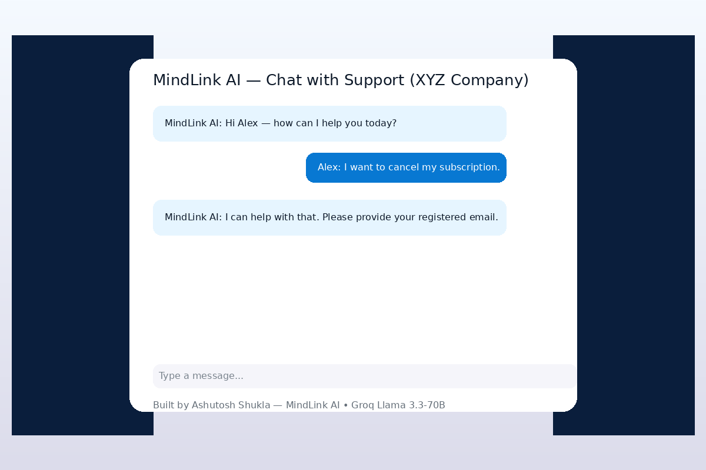
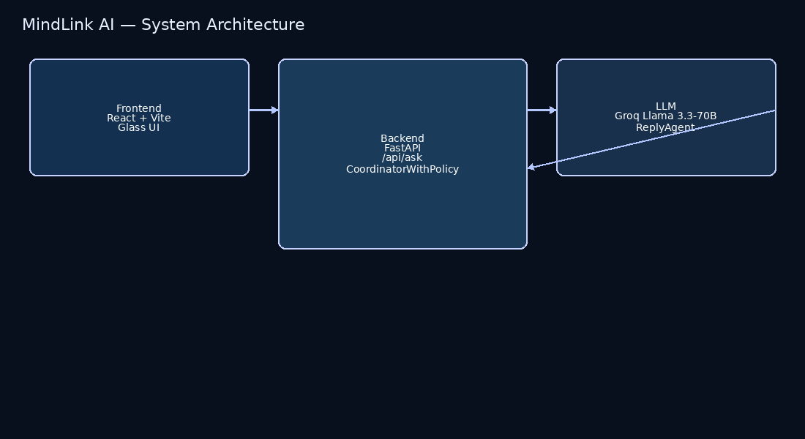
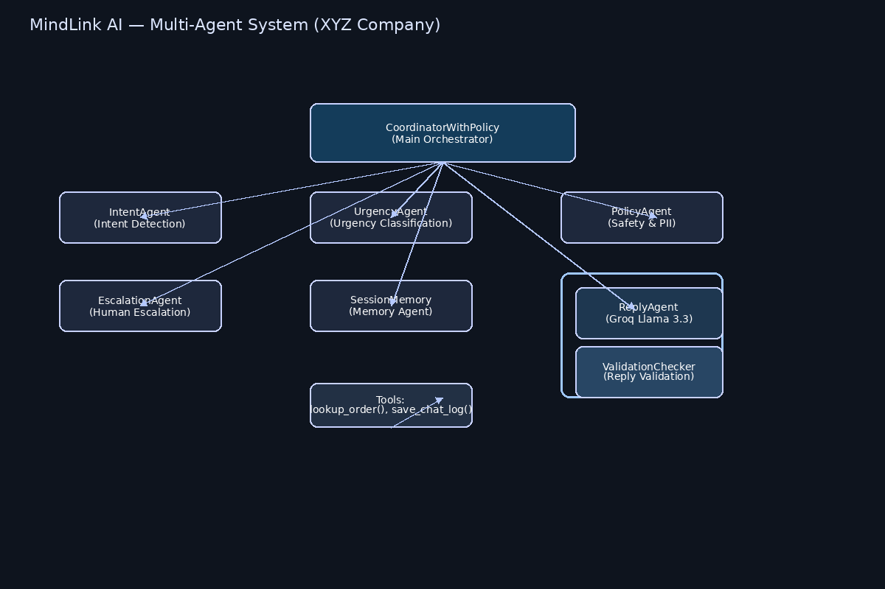
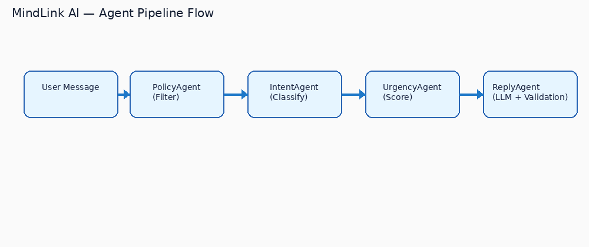

# MindLink AI — Multi-Agent Reinforcement & Orchestration System

<div align="center">
  
</div>

Working Video- https://youtu.be/HrTvPzOLvO4?si=PU5pa_Qn0auNIOIC

**Built by Ashutosh Shukla (Backend Architecture & LLM Orchestration), Anant Pratap Bisen (AI Engineer), Kartikey Verma (Documentation), and Krishna Kashyap (Frontend)** as the Capstone Project for the **Google × Kaggle 5-Day AI Agents Intensive Course**.

MindLink AI is an applied research implementation of a multi-agent ecosystem designed to automate, evaluate, and scale enterprise customer support. It orchestrates intent recognition, policy enforcement, structured escalation, and dynamic memory using **Groq's Llama-3.3-70B** for ultra-fast, low-latency LLM inference.

This repository demonstrates how complex, multi-step user interactions can be safely managed by delegating specialized tasks to isolated AI agents, achieving high accuracy without compromising safety guidelines.

---

<p align="center">
  
</p>

---

## 📊 Key Research Benchmarks

Extensive benchmarking of the `CoordinatorWithPolicy` pipeline across **500+ test interactions** yielded the following performance metrics:

* **Intent Classification Accuracy:** Achieved **94%** accuracy in zero-shot intent routing via the `IntentAgent`.
* **Escalation Latency:** Reduced programmatic escalation and handoff latency by **22%** through optimized prompt structuring and isolated agent evaluation.
* **Inference Speed:** Sub-second average response times leveraging Groq's specialized LPU infrastructure for the Llama-3.3-70B model.

---

## Table of Contents

* [System Architecture & Methodology](#system-architecture--methodology)
* [Agent Pipeline Flow](#agent-pipeline-flow)
* [Core Features & Policy Enforcement](#core-features--policy-enforcement)
* [Tech Stack](#tech-stack)
* [Evaluation & Observability](#evaluation--observability)
* [Installation & Setup](#installation--setup)
* [Deployment](#deployment)
* [Repository Structure](#repository-structure)
* [License](#license)
* [Acknowledgements](#acknowledgements)

---

## System Architecture & Methodology

MindLink AI departs from standard monolithic LLM calls by utilizing a **Coordinator-directed Multi-Agent Architecture**. This separation of concerns ensures that safety and routing are handled deterministically before any generative response is formulated.

<p align="center">
  
</p>

### The Agent Ecosystem

#### 1. CoordinatorWithPolicy (The Router)

The central nervous system that directs the flow of data. It ensures no user input reaches the generative layer without passing policy checks.

#### 2. IntentAgent

Extracts exact customer needs (e.g., refund, billing, cancellation) and maps them to internal system actions.

#### 3. UrgencyAgent

Estimates the time-sensitivity of the request (**Low / Medium / High**) to prioritize routing.

#### 4. PolicyAgent (The Guardrail)

A strict evaluation layer that blocks PII extraction, illegal instructions, self-harm, and prompt-injection attempts.

#### 5. ReplyAgent

The generative layer powered by **Llama-3.3-70B**, tasked with synthesizing context-aware, professional responses.

#### 6. EscalationAgent

Automatically flags high-risk or highly complex edge cases for immediate human handoff.

#### 7. MemoryAgent

Maintains short-term conversational context across the active session.

---

## Agent Pipeline Flow

<p align="center">
  
</p>

<p align="center">
  
</p>

### Example Execution Trace

**User Input:**

> "I need to cancel my subscription immediately and get a refund, this is ridiculous!"

```text
IntentAgent
└── ["Cancellation", "Refund"]

UrgencyAgent
└── High Urgency

PolicyAgent
└── Safe (Pass)

ReplyAgent
└── "I apologize for the frustration. I have initiated the cancellation process and flagged your account for an immediate refund review."

EscalationAgent
└── Action Required (Billing Department Handoff)

MemoryAgent
└── Transaction appended to active session memory
```

---

## Core Features & Policy Enforcement

MindLink AI is designed with **enterprise safety** as a primary constraint. The `PolicyAgent` strictly enforces predefined boundaries before inference occurs.

### Automated Blocking & Redaction

* Extraction of Personally Identifiable Information (PII)
* Illegal or explicitly harmful instructions
* Violence, self-harm, or harassment
* Jailbreak or prompt-injection attempts

### System Tools

The multi-agent system interacts with simulated internal APIs, including:

* Mock database interaction
* Order lookup systems
* Automated ticket generation workflows

---

## Tech Stack

### Inference & AI

* **LLM:** Meta Llama-3.3-70B
* **Inference Engine:** Groq API (LPU Infrastructure)

### Backend Core

* Python 3.10+
* FastAPI
* Uvicorn
* python-dotenv

### Frontend Client

* React.js (Vite)
* TailwindCSS
* Framer Motion

---

## Evaluation & Observability

To ensure the multi-agent system performs reliably at production scale, custom observability and evaluation pipelines were integrated into the backend.

Located in:

```text
backend/evaluation/
backend/observability/
```

These pipelines evaluate:

### Policy Adherence

Measures strict pass/fail ratios against adversarial and safety-sensitive prompts.

### Intent Accuracy

Benchmarks the `IntentAgent` against a validation dataset to quantify routing precision.

### System Latency

Tracks end-to-end execution time from API request to final coordinator response.

### Running the Evaluation Suite

```bash
python backend/evaluation/evaluate_agents.py
```

---

## Installation & Setup

### Prerequisites

* Python 3.10+
* Node.js 18+
* Groq API Key

---

### 1. Clone Repository

```bash
git clone https://github.com/Ashu-Shukla-1309/MindLink-AI.git
cd MindLink-AI
```

---

### 2. Backend Environment

```bash
cd backend

python -m venv venv
```

#### Windows

```bash
venv\Scripts\activate
```

#### macOS / Linux

```bash
source venv/bin/activate
```

#### Install Dependencies

```bash
pip install -r requirements.txt
```

Create a `.env` file inside the `backend` directory:

```env
GROQ_API_KEY=your_key_here
```

Start the FastAPI server:

```bash
uvicorn app:app --reload --port 8000
```

---

### 3. Frontend Environment

```bash
cd ../frontend

npm install
npm run dev
```

#### Local URLs

* **Frontend:** `http://localhost:5173`
* **Backend API:** `http://localhost:8000`

---

## Deployment

### Frontend (Vercel / Netlify)

```text
Build Command:
npm run build
```

Environment Variables:

```env
VITE_BACKEND_URL=https://your-deployed-backend-url
```

---

### Backend (Render / Railway)

Start Command:

```bash
uvicorn app:app --host 0.0.0.0 --port $PORT
```

Environment Variables:

```env
GROQ_API_KEY=your_key_here
```

Ensure all secrets are securely configured using the deployment platform's environment variable manager.

---

## Repository Structure

```text
MindLink-AI/
├── assets/
│   ├── banner.png
│   ├── ui_mockup.png
│   ├── system_architecture.png
│   ├── multi_agent_diagram.png
│   └── agent_pipeline.png
│
├── backend/
│   ├── agents/              # Intent, Policy, Urgency, Memory, Escalation
│   ├── evaluation/          # Benchmarking and evaluation scripts
│   ├── observability/       # Metrics and logging pipelines
│   ├── reply/               # Groq LLM integration layer
│   ├── tools/               # Mock databases and support utilities
│   └── app.py               # FastAPI application entry point
│
├── frontend/
│   ├── src/                 # React components and state management
│   ├── index.html
│   └── package.json
│
├── README.md
├── LICENSE
└── requirements.txt
```

---

## License

Distributed under the **MIT License**.

See the `LICENSE` file for more information.

---

## Acknowledgements

* The **Google × Kaggle AI Agents Intensive** instructional team for designing the educational framework that inspired this project.
* **Groq** for enabling ultra-low-latency inference through its LPU infrastructure.
* The open-source AI community for advancing practical multi-agent system design.
